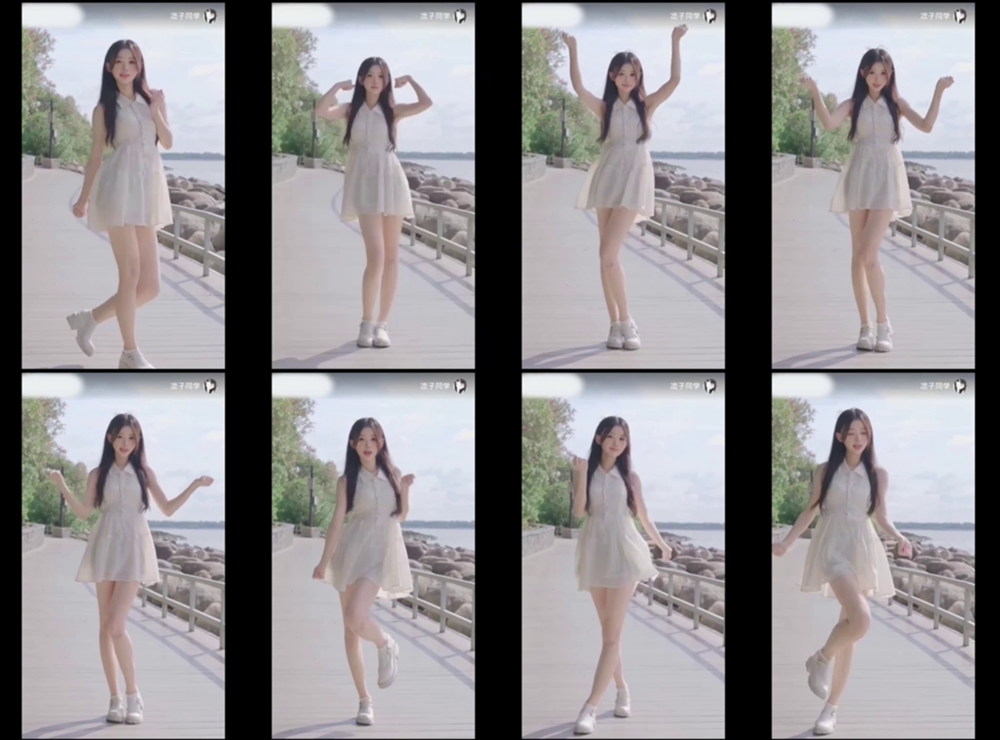

# Universal Motion Representation for Cross-Category and Zero-Shot Image Animation

## 📌 Overview
This project proposes a Universal Motion Representation framework that enables motion transfer across structurally different object categories in a zero-shot setting.

The system decouples motion semantics from object appearance, allowing human motion to be transferred to non-human characters while preserving identity and temporal consistency.

---

## 🚀 Key Contributions
- ✔ Universal motion encoder for category-agnostic motion learning
- ✔ Motion–appearance decoupling mechanism
- ✔ Attention-based alignment for adaptive motion transfer
- ✔ Diffusion-based video refinement for temporal consistency
- ✔ Cross-category animation without retraining
- ✔ Zero-shot generalization capability

---

## 🧠 Methodology

The framework consists of four major components:

1. **Universal Motion Encoder**
   - Extracts category-invariant motion embeddings from driving videos.

2. **Semantic Feature Extractor**
   - Preserves structural and identity features from the source image.

3. **Attention-Based Alignment Module**
   - Aligns motion semantics with the structural constraints of the target object.

4. **Diffusion-Based Generation Pipeline**
   - Refines frames progressively to ensure smooth temporal transitions.

---

## 🎥 Experimental Setup

### Input:
- Static animal poster image (Source Image)
- Human dance video (Driving Video)

### Output:
- Animated animal character performing human dance motion

---

## 📊 Results

- Preserved visual identity across motion frames
- Smooth temporal consistency
- Successful cross-category motion transfer
- Zero-shot animation without retraining

---

## 📷 Sample Outputs

---

## 📄 Documentation

Full project report available in this repository.

---

## 🔬 Research Focus

This project advances image animation toward:
- Open-domain generative systems
- Identity-preserving motion synthesis
- Scalable cross-category animation frameworks

---

## 👩‍💻 Author

Bineesha  
B.Tech – Artificial Intelligence and Machine Learning  
B V Raju Institute of Technology
